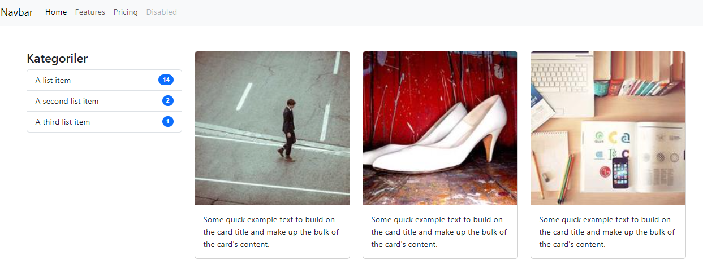
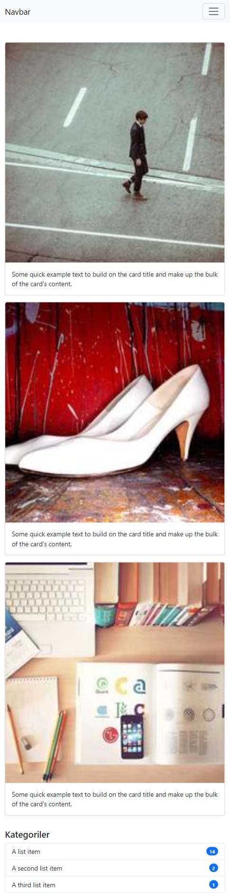

# HTML,CSS ve Bootstrap ile ilgili çalışmalar

1. Bootstrap içerisindeki yapılar incelendi ve onlarla alakalı örnekler yapıldı.
   Responsive yapıda içerisinde navbar'ıda bulunan order kullanımının gösterilmiş olduğu çalışma

   
2. 

   Offset'in çalışma mantığı bir tane çalışmada gösterildi

   
